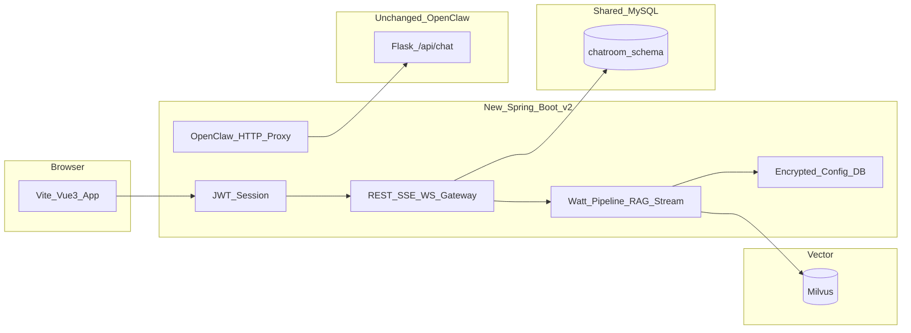

# Chatroom V2 改造计划（完整版）

> **主副本位置**：本文件 — `chatroom-v2-web` 项目根目录（与 `chat_vue` 同级）。  
> 旧仓库内 [`../chat_vue/CHATROOM_V2_PLAN.md`](../chat_vue/CHATROOM_V2_PLAN.md) 仅为指针。  
> Cursor 可能另有副本：`.cursor/plans/chatroom_v2_改造计划_*.plan.md`（带 YAML 头），**以本文件为唯一完整正文**。

## 执行清单（TODO）

| 状态 | 任务 |
|------|------|
| pending | `chatroom-v2-web`：Vue3 + Vite + TS + Pinia + Element Plus，复刻群聊 / 家庭成员 / 瓦特 |
| pending | `chatroom-v2-api`：Spring Boot + 同一 MySQL、JWT/Session、迁移仅加表/列 |
| pending | 瓦特：`structured` JSON 协议 + 后端天气等示例管线 + 动态组件 Weather / Plain |
| pending | `ai_provider_config`、管理端 Key、瓦特门禁 |
| pending | SSE/WS 流式、RAG 开关、引用、相似度阈值、取消生成 |
| pending | embedding 推荐 Tab |
| pending | Java 代理 OpenClaw `/api/chat` + 第二聊天入口 |

---

## 目标与约束

- **不动老仓库业务代码**：[`../chat_vue`](../chat_vue)、[`../chat_java`](../chat_java)、[`../openclaw`](../openclaw)（若同级）保持现状；新能力放在 **新项目** `chatroom-v2-web`、`chatroom-v2-api`（与旧项目并列）。
- **数据库**：仍指向现有 `chatroom` 库；**仅通过迁移 SQL 新增表/字段**，不破坏旧表数据。
- **安全底线**：LLM / Embedding / Tavily 等 Key **仅存后端**（DB 加密列或环境变量 + 管理端配置），前端只带 **Session / JWT**，浏览器不出现第三方 Key。  
  当前旧代码中 DashScope Key 硬编码见：  
  [`chat_java/.../TuLingUtil.java`](../chat_java/src/main/java/top/javahai/chatroom/utils/TuLingUtil.java)、[`EmbeddingUtil.java`](../chat_java/src/main/java/top/javahai/chatroom/utils/EmbeddingUtil.java) — **V2 禁止照抄。**

## 文案与命名（需求 1）

- 旧版私聊侧栏为「用户列表」；V2 **私聊列表区域标题/Tab 等与「好友列表」同义的文案统一为「家庭成员」**。
- 机器人：旧版「瓦力(智能回复)」→ V2 统一 **「瓦特」**；与后端 `to` 约定：前端会话名用常量，**发往现有 `chat_java` 时 WebSocket 仍用 `to: "机器人"`**，发送/接收处映射（如 `SESSION_ROBOT` / `ROBOT_WIRE_USERNAME`）。

## 总体架构（新前后端 + 旧库 + OpenClaw 旁路）

## 数据库增量（V2 共用，按需分阶段执行）

建议新建迁移脚本（示例 `v2_migration_001.sql`），按需包含：

| 用途 | 建议 |
|------|------|
| 管理端保存模型 Key | 表 `ai_provider_config`：`id`，`provider`（如 dashscope），`api_key_cipher`，`embedding_key_cipher`（可同列或拆分），`updated_at`，`updated_by_admin_id`；Key 使用应用层加密（AES + 环境变量 `CONFIG_MASTER_KEY`） |
| 用户侧瓦特偏好 | `user` 表新增：`watt_rag_enabled`，`watt_similarity_threshold`（float），或独立 `user_ai_prefs` |
| 提示词版本（后续） | `system_prompt_revision`：`version`，`content`，`effective_from` |
| 消息结构化展示（步骤 2） | `private_msg_content` 或 V2 专用扩展表：如 `structured_payload` JSON（可选；若首版纯前端解析可后置） |

**注意**：若 V2 仍读写旧表 `private_msg_content` 等，需与旧服务**错开部署**或约定「仅 V2 写新字段」，避免双写冲突。

## 阶段划分（与「两天只做前两步」对齐）

### 第一步：升级前端框架并复刻 chat_vue（需求 1 + 工程基础）

**技术选型（Vue2 不可直接装 Vue3 生态）：**

- **Vue 3 + Vite + TypeScript**；状态 **Pinia**；路由 **Vue Router 4**。
- UI：Element UI → **Element Plus**。
- 实时：**STOMP over SockJS**（旧项目 [`usertext.vue`](../chat_vue/src/components/chat/usertext.vue) 使用 `/ws/robotChat` 等）；V2 用 `@stomp/stompjs` + sockjs-client；基地址与 cookie 与旧版一致。
- HTTP：axios 封装，401 等行为与 [`api.js`](../chat_vue/src/utils/api.js) 对齐。

**复刻范围（对照旧项目目录）：**

- 视图：登录/注册、主聊天 [`ChatRoom.vue`](../chat_vue/src/views/chat/ChatRoom.vue)、管理端入口（可先占位）。
- 组件：[`toolbar.vue`](../chat_vue/src/components/chat/toolbar.vue)（群聊 / **家庭成员** / 瓦特）、[`list.vue`](../chat_vue/src/components/chat/list.vue)、[`message.vue`](../chat_vue/src/components/chat/message.vue)、[`usertext.vue`](../chat_vue/src/components/chat/usertext.vue)。
- Vuex → Pinia：会话、`currentSession`、`sessions`、STOMP 客户端等。

**后端配合**：可先联调**现有** `chat_java` 以最快验证 UI；正式方案为新建 **V2 后端** + 同一 MySQL，再逐步把 WebSocket 切到 V2。若时间紧：先 V2 前端对旧后端联调，再切瓦特管线（需约定接口契约）。

### 第二步：瓦特通用「结构化回显」界面（需求 7）

**目标**：如「一周天气」等，不只纯文本，而按 **消息类型** 渲染卡片（图标、气温区间等）。

**协议**：瓦特回复除 `text/markdown` 外，可选 **`contentType`**（如 `weather_week` / `weather_day` / `plain`）与 **`structured`**（JSON：城市、`daily[]`、`source` 等）。

**实现路径：**

- **A（推荐）**：V2 后端调用 DashScope 时 **JSON Mode / 响应格式约束**，或 **解析 Prompt** 让模型输出固定 JSON，校验后存库/下发前端。
- **B**：首版对「天气」类用 **规则 + 公开 HTTP 天气 API** 填 `structured`，LLM 只生成摘要。

**前端**：`<component :is="resolveRenderer(contentType)" />`，默认回退 Markdown；天气用 `WeatherWeekCard.vue` 等。

---

## 其余需求推荐顺序（第三步及以后）

| 顺序 | 需求编号 | 内容 | 说明 |
|------|----------|------|------|
| 3 | 2 | 管理端录入模型 Key；未配置则禁止瓦特聊天 | `ai_provider_config` + 管理端表单 + 后端 `GET /ai/config/status`（示例） |
| 4 | 4 | 网关化 Key | 与 3 同一套；Embedding/Tavily 均只读服务端配置 |
| 5 | 3 | SSE/WebSocket 流式 + RAG 开关 + 引用 + 相似度阈值 | 迁移 [`WsController`](../chat_java/src/main/java/top/javahai/chatroom/controller/WsController.java) 同类逻辑；Milvus 分数与 `hasHighRelevanceKnowledge` 对齐；前端 `EventSource` 或 WS 分片 |
| 6 | 5 | 停止生成 + 后端取消 | Java：`ExecutorService` + `Future.cancel` / 关闭 HTTP 客户端；或 SSE 断开触发中断 |
| 7 | 6 | AI 推荐 Tab（embedding） | 最近一句 embedding → 与预设问题向量比对 → 返回 3～5 个 chips |
| 8 | 8 | OpenClaw 第二入口 | **不改** openclaw：V2 后端反向代理到 `OPENCLAW_BASE_URL`，如 `POST /api/v2/openclaw/chat`，转发 [`run_server.py` 中 `/api/chat`](../openclaw/openclaw/run_server.py) 的 `prompt` + `chat_id`（`chat_id` 建议用 `userId` 隔离）；前端「瓦特」旁加「Copilot 助手」入口，**仅**简单输入框 + 非流式展示 `response` |

OpenClaw 当前 **无鉴权**，生产环境建议 **Nginx 内网 + 仅经 V2 后端出口**，勿把 8000 端口直接暴露公网。

## 风险与注意

- **双服务同一库**：迁移前备份；尽量「只加列、不改语义」。
- **密钥**：轮换旧仓库已暴露在代码中的 Key（TuLingUtil / EmbeddingUtil 硬编码视为泄露）。
- **「我的机器」**：openclaw 仅有 CLI [`openclaw-box.sh`](../openclaw/openclaw-box.sh)；若要做「机器面板」可在新前端单独做一页链到 OpenClaw 管理 API（可选）。

## 交接给新会话的用法

将本文件路径与下列代码路径一并提供给续写 AI：

| 说明 | 路径 |
|------|------|
| 旧前端 | [`chat_vue/src`](../chat_vue/src) |
| 旧机器人 WebSocket | [`WsController.java`](../chat_java/src/main/java/top/javahai/chatroom/controller/WsController.java) |
| OpenClaw 聊天 API | [`openclaw/openclaw/run_server.py`](../openclaw/openclaw/run_server.py)（约 929 行起 `POST /api/chat`） |

并明确 **当前迭代范围**（例如：仅完成第一步 + 第二步）。
